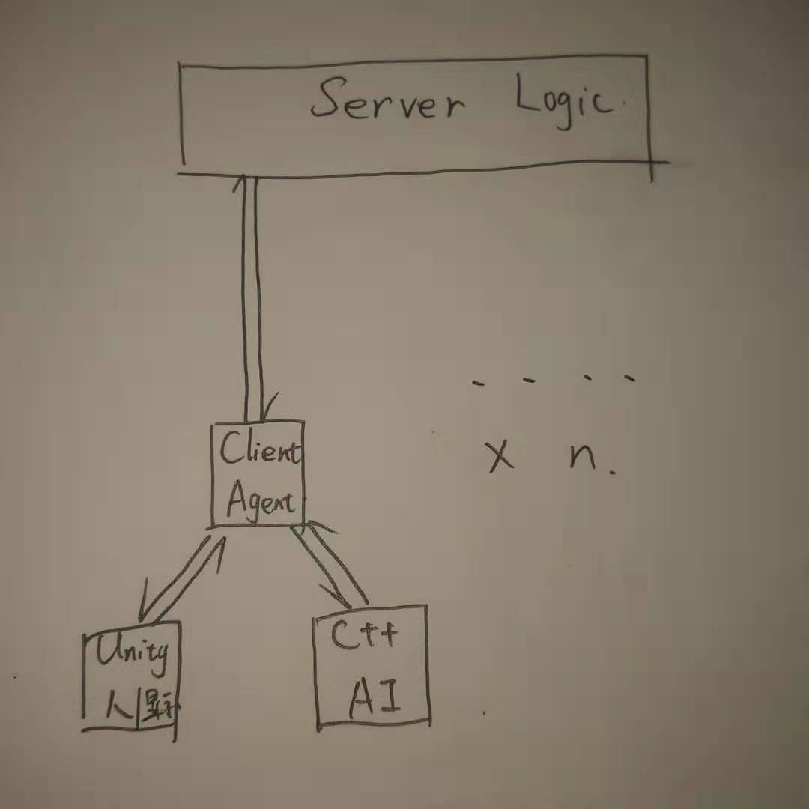

# THUAI3.0整体架构与对接细节
THUAI3.0 原电子系第21届队式程序设计大赛

## 整体架构
初步确定为C/S架构，服务端Server处理所有游戏逻辑，客户端采用两种工作模式：
- 人：启动Unity与代理Agent，Unity处理显示与输入，通过代理与服务端通信
- AI：启动AI程序与代理，Unity界面可选，AI通过代理与服务端通信，Unity只处理显示

画饼:
- 利用事件机制实现实时数据处理
- 客户端主动轮询来更新信息（可以考虑增量更新）
- 通信延时显示，连接情况显示
- 对局速度调整，区分人与人、人与AI、AI与AI
- Unity支持实时显示与回放
- ...

## 对接细节
暂无